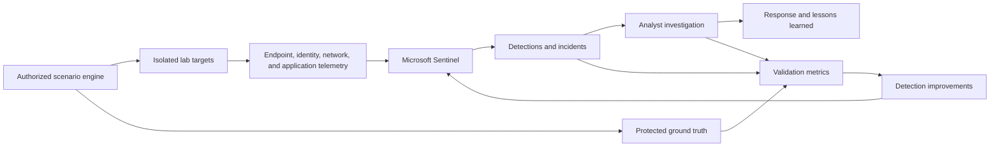

# Microsoft Sentinel SOC Validation Platform

An incremental cybersecurity homelab for learning Microsoft Sentinel and Microsoft Defender, preparing for SC-200, practicing security operations, and eventually validating detections through randomized, authorized attack simulations.

> **Status:** Phase 0 documentation complete; private Azure readiness checks remain before Phase 1 deployment

## Project outcomes

- Operate a functional Microsoft Sentinel SIEM.
- Investigate alerts and incidents across Windows, Linux, identity, network, and application telemetry.
- Build reusable KQL detections and threat-hunting queries.
- Automate enrichment and response with Sentinel automation rules and Logic Apps.
- Map detection coverage to MITRE ATT&CK.
- Develop a safe SOC validation platform that measures detection and response effectiveness.
- Produce evidence suitable for a cybersecurity portfolio and SC-200 preparation.

## Delivery phases

| Phase | Focus | Target duration |
|---|---|---:|
| 0 | Planning, governance, repository, safety, and cost controls | 1 week |
| 1 | SC-200-aligned Sentinel foundation | 3–5 weeks |
| 2 | Hybrid enterprise-style monitoring environment | 6–10 weeks |
| 3 | Randomized SOC validation platform | Iterative |

See the detailed [roadmap](docs/roadmap.md) and [project charter](docs/project-charter.md).

## Conceptual architecture

## Repository map

| Path | Purpose |
|---|---|
| `docs/` | Architecture, decisions, study notes, deployment guides, and case reports |
| `infrastructure/` | Azure, Proxmox, and network configuration or infrastructure as code |
| `detections/` | Version-controlled detection content by SIEM |
| `hunting/` | Threat-hunting queries and hypothesis documentation |
| `automation/` | Logic Apps, Python, and PowerShell automation |
| `scenarios/` | Safe simulation definitions, mappings, and expected telemetry |
| `workbooks/` | Sentinel workbook definitions and supporting documentation |
| `samples/` | Sanitized example data only |
| `tests/` | Detection, scenario, and infrastructure validation tests |

## Current milestone

Build one complete vertical slice:

1. Deploy a cost-controlled Log Analytics workspace and enable Sentinel.
2. Connect one Windows endpoint.
3. Generate benign test activity.
4. Write and validate one KQL detection.
5. Investigate the resulting incident.
6. Document evidence, ATT&CK mapping, cost, and lessons learned.

## Safety and privacy

All simulations must run only against systems owned by or explicitly authorized for this lab. Review the [rules of engagement](docs/security/rules-of-engagement.md) before executing any scenario.

Never commit secrets, callback URLs, tokens, private keys, Terraform state, unsanitized logs, personal information, or identifying cloud resource details. Use `.env.example` files for variable names and store actual secrets outside Git.

## Documentation standard

Each meaningful lab capability should document:

- Objective and SC-200 relationship
- Architecture and security rationale
- Prerequisites and cost impact
- Implementation and rollback procedure
- Expected telemetry and affected tables
- Detection or hunting logic
- MITRE ATT&CK mapping
- Validation evidence
- Lessons learned and future improvements

## Licensing

This repository is licensed under the [MIT License](LICENSE).
