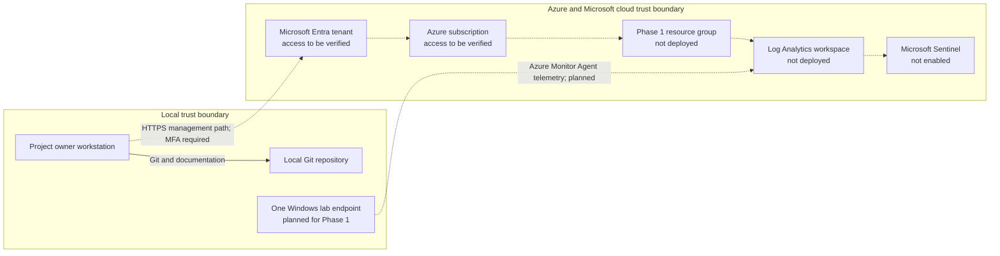

# Current-State Architecture

- **Baseline date:** 2026-09-17
- **Scope:** Phase 0 planning baseline and the components required to begin Phase 1
- **Classification:** Sanitized; no tenant IDs, subscription IDs, public IP addresses, or secrets

## Current state

The project is currently documentation and source control only. No Azure resources,
Microsoft Sentinel workspace, data connectors, monitored endpoints, or attack-simulation
systems are represented as deployed in this repository. Phase 1 will add the first
working telemetry path.

Solid lines are present local relationships. Dashed lines are planned or require
verification before deployment.

## Trust boundaries and data flows

| Boundary or flow | Current state | Phase 1 control |
|---|---|---|
| Administrator to Microsoft cloud | Not verified | Named account, MFA, least-privilege Azure RBAC |
| Windows endpoint to Log Analytics | Not deployed | Outbound TLS only, Azure Monitor Agent, narrow data collection rule |
| Log Analytics to Sentinel | Not deployed | One workspace, deliberate retention, cost monitoring |
| Repository to public remote | Local repository present | Sanitized artifacts only; no identifiers, secrets, or raw logs |
| Internet exposure | None required by the current design | No inbound exposure for the monitored endpoint |

## Identity and secrets

- Use a named administrator account protected by MFA.
- Assign only the roles required for each deployment or analyst task.
- Store real tenant and subscription identifiers outside tracked files.
- Never store client secrets, workspace keys, tokens, or Logic App callback URLs in Git.
- Use `.env.example` only to document variable names.

## Cost-bearing services

The current repository does not itself incur cloud charges. Phase 1 can incur charges
from Log Analytics or Sentinel ingestion and retention, an Azure-hosted Windows VM if
one is chosen, and optional Defender or Microsoft 365 licensing. Deploy only after the
inventory and budget preflight in `../azure/subscription-licensing-inventory.md` is
complete.

## Phase 1 target delta

Phase 1 adds one resource group, one Log Analytics workspace with Sentinel enabled,
one Windows lab endpoint, one narrow telemetry source, and one end-to-end detection and
investigation. Phase 2 networking, Proxmox workloads, Active Directory, Linux, network
sensors, and automated simulations remain outside this baseline.

